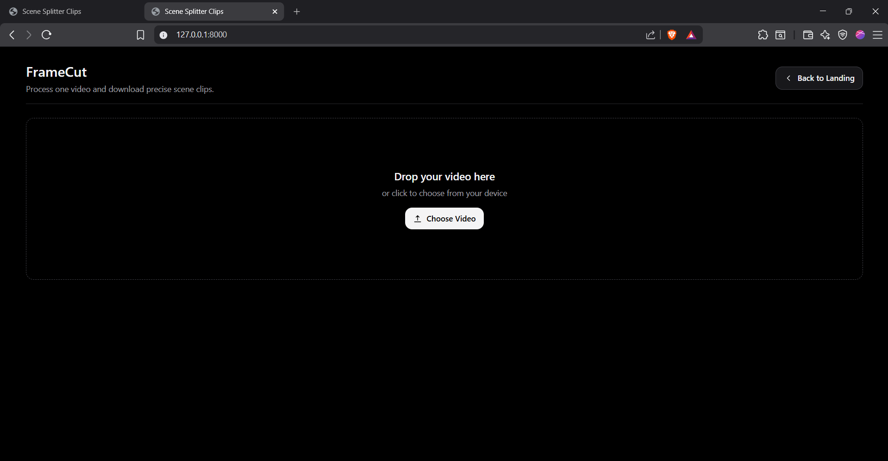
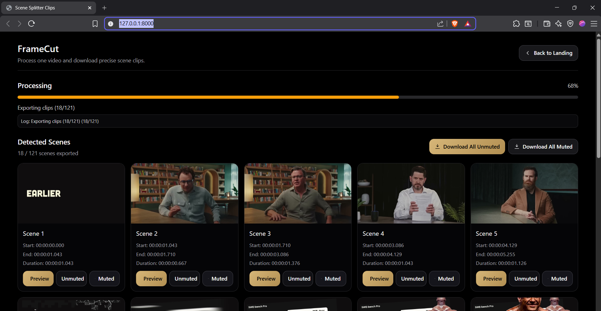
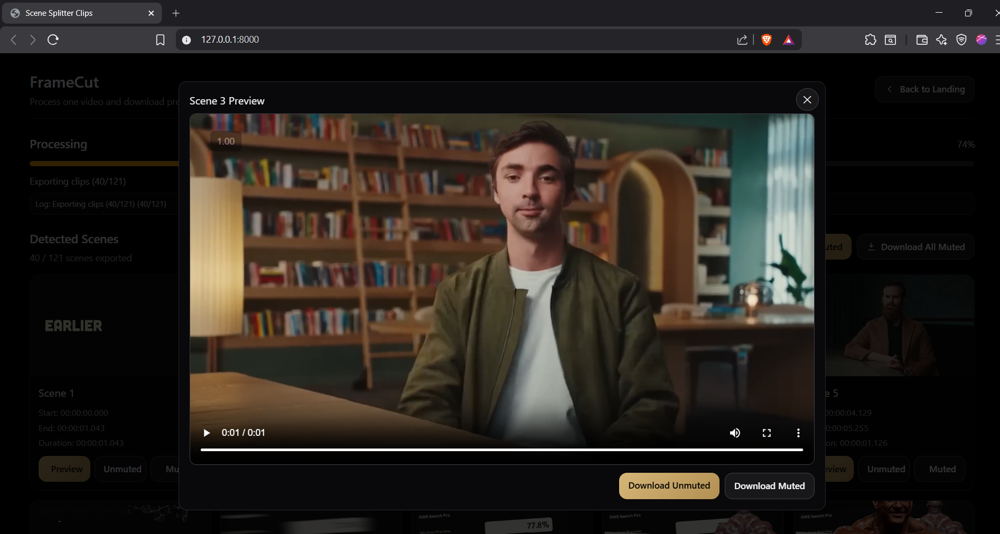

# FrameCut

A dedicated web app that detects shot/scene boundaries from an uploaded video and exports each scene as its own clip.

## Screenshots

### Upload

Drag and drop a video or choose a file from your device.



### Results

Browse detected scenes with thumbnails, timestamps, and bulk download options.



### Preview

Open any scene in a full preview player with per-scene muted and unmuted downloads.



## Features

- Drag-and-drop video upload.
- Advanced content-based scene detection (hybrid adaptive + content detector).
- Progress indicator while processing.
- Scene gallery with:
  - Thumbnail
  - Scene number
  - Start timestamp
  - End timestamp
  - Duration
- Per-scene preview in a large modal player.
- Per-scene download + Download All Scenes (ZIP).

## Tech Stack

- Backend: FastAPI
- Scene Detection: PySceneDetect (`AdaptiveDetector` + `ContentDetector`)
- Clip/thumbnail export: FFmpeg
- Frontend: vanilla HTML/CSS/JS (responsive, modern UI)

## Setup

1. Install [FFmpeg](https://ffmpeg.org/download.html) and ensure `ffmpeg` is available in your PATH.
2. Create and activate a virtual environment.
3. Install dependencies:

```bash
pip install -r requirements.txt
```

4. Run the app:

```bash
uvicorn main:app --reload
```

5. Open `http://127.0.0.1:8000`.

## Accuracy Notes

- The detection pipeline prioritizes accuracy over speed:
  - Uses adaptive thresholding to reduce false cuts from camera movement or lighting shifts.
  - Uses content-based detection to catch hard transitions.
  - Uses minimum scene length guards against over-segmentation.
- Clip extraction re-encodes with near-lossless settings (`crf 18`, `preset slow`) for frame-accurate scene boundaries.

You can fine-tune thresholds in `main.py` depending on your content type (fast cuts, dark scenes, animation, etc.).
